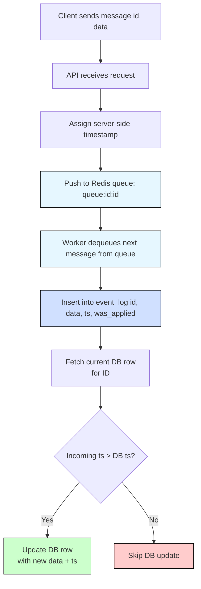

## Table of Contents

1. Original Problem Summary
2. Personal Experience with Similar Problems
3. Solution Approach Option 1 - Per-Id queue in Redis
	1. Diagram
	2. Cases this Architecture Solves
	3. Edge Cases / Risks
4. Solution Approach Option 2 - Optimistic Versioned Upsert with Conflict Skipping
	1. Diagram
	2. Cases this Solves
	3. Edge Cases / Risks
5. Summary Comparison Pros/Cons Table


---
## Original Problem Summary

The system provides an /upsert API endpoint that either inserts or updates a record by ID. In a distributed, multi-server environment, two messages with the same ID can be processed out of order — for example, server A processes an earlier message more slowly than server B processes a newer one.

As a result, the newer message can be overwritten by the older one, breaking message order and leaving the database in an incorrect state.

The challenge is to design an architecture that:

1. Preserves message ordering per ID

2. Ensures data consistency and integrity

3. Works reliably in a multi-threaded, distributed environment

With this problem defined properly and the focus being on those three objectives, I provide below two solutions, along with their trade-offs. I also include diagrams for both.
## Personal Background in dealing with this problem

I have run into these issues before in real-world scenarios. One example was a search engine I made (it is still in use by the government today). When I designed Obskura, the dark web search engine, besides having a big t+1 problem in terms of indexing a web-page and then calculating the periodicity on visiting it again for any changes at a future time, as well as issues of connecting to TOR programmatically with thousands of web scrapers and orchestrating keeping track of both new pages (discovery), spidering found domains (going deep), and orchestrating workers and queues in an idempotent way (a site could fail to load, etc.) -- Obskura also had the problem of how to manage processing steps for each collected html page.

I designed a simple ETL pipeline using Redis queues. In this case order did not matter, so I used redis sets per domain, a master list of domains, and a master list of links in the queue to process tied to every page as the UUID and the common hashmap being the domain UUID and page UUID. For each stage there was an idea of doneness tracked in the hashmap, so if something was not done parsing the title for instance, a worker tasked with that would pop it off the queue and everything was eventually processed. Depending on the number of concurrent workers, everything finished per collection cycle and we were processing up to 150,000 transactions a second, which is pretty much the limit of Redis in memory at the time and the bottleneck became the CAT 5e cables between server racks. The problem outlined above in the summary is a much more tractable and basically I would consider one of the bite size problems that you need to solve when building out something like a dark web search engine or any system of a certain level of complexity in terms of its use case and operations.
## Solution Approach 1 - Per-ID Queued Processing with Redis

This architecture ensures strict per-ID ordering by queueing incoming messages in Redis queues partitioned by ID.

The API server assigns a timestamp at enqueue time to avoid relying on potentially skewed client clocks.

A dedicated worker consumes messages one-by-one for each ID, compares the timestamp with the existing database record, and only applies updates if the message is newer.

All messages, applied or skipped, are written to an event_log table for auditability and future replay.



### Cases This Architecture Solves


1. Out-of-order message arrival

Even if messages for the same ID arrive on different servers at different times, they’re queued per ID in Redis.
FIFO processing by workers ensures updates are handled in order.

1. Duplicate messages

All messages are logged to an event_log.
If the same message is enqueued twice, only the latest (by timestamp) makes it to the DB; others are skipped.

1. Clock skew / client timestamp manipulation

Server assigns timestamp at ingestion → no reliance on untrusted or unsynced client clocks.

1. Concurrent updates across multiple nodes

Redis queues per ID serialize the operations: only one worker processes each queue at a time.
No need for distributed locks or mutexes.

1. Auditability and replay

Full message history is preserved in an append-only event_log table.
You can reprocess/replay events or do forensic analysis.

1. Avoiding lost updates

Only newer messages (based on timestamp) are allowed to update the database.
Older ones are skipped but still logged.

### Edge Cases / Limitations

1. Hot keys / high-frequency IDs

If one ID receives a ton of messages, its Redis queue becomes a bottleneck.
Processing is serialized per ID, so throughput for that key is limited by single-threaded dequeue rate.
Mitigation: Use batching or adaptive backoff for noisy IDs; shard large IDs if possible.

2. Redis persistence or message loss

If Redis isn’t configured for persistence and crashes, you lose in-flight messages.
Mitigation: Use Redis with AOF/RDB backups or a more durable queue (e.g., Kafka). You could also persist to event_log before queuing.

3. Late-arriving messages with valid intent

If a message is delayed and comes after newer ones, it will be skipped.
Mitigation: Define business rules for this — e.g., accept if within 1-minute window, or trigger a correction flow instead of skipping silently.

4. No cross-ID ordering

If your business logic requires an event for ID=2 to only be processed after an event for ID=1, this architecture won’t enforce that.
Mitigation: Introduce orchestration logic at the application level (not ideal for scale).

5. Timestamp collisions

If multiple messages are assigned the same timestamp (e.g., in the same millisecond), ordering could still break.
Mitigation: Use ts + nonce or strictly incrementing version counters per ID in place of raw timestamps.

6. Failure during DB update

If the DB update fails after dequeueing and logging but before the update, and the message isn’t re-queued → it’s lost.
Mitigation: Wrap processing in a retry-safe worker, or use Redis streams or Kafka for at-least-once guarantees with offset tracking.

## Solution Approach 2 - Optimistic Versioned Upsert with Conflict Skipping

In this approach, each incoming request includes a timestamp or version and is processed immediately, without serialization or queueing.

The database enforces correctness by only applying updates where the incoming timestamp is newer than what’s already stored.

This enables high throughput and low latency, but assumes timestamps are trusted or assigned server-side.

An optional event_log ensures all updates — even rejected/stale ones — are retained for traceability.

  ```mermaid
flowchart TD

A[Client sends message with ID, data, timestamp] --> B[API receives request]

B --> B1[Insert message into event_log table]

B1 --> C[Fetch existing row from DB by ID]

C --> D{Row exists?}

D -- No --> E[Insert new row with data and timestamp]

D -- Yes --> F[Compare incoming timestamp with existing timestamp]

F --> G{Incoming > Existing?}

G -- Yes --> H[Update DB row with new data and timestamp]

G -- No --> I[Skip update, record was stale]

  

style B1 fill:#d0e0ff,stroke:#000

style E fill:#ccffcc

style H fill:#ccffcc

style I fill:#ffcccc
```


### Cases Solution 2 Architecture Solves

1. Out-of-order writes

Stale writes are rejected by checking incoming_ts > existing_ts in the DB.
Only the newest data is persisted.

2. Multiple concurrent servers or threads

No locking or queuing needed. All servers can process requests in parallel.
The DB acts as the arbiter of truth via a conditional upsert.

3. Low latency, high throughput

No waiting on a queue per ID. Each request is handled independently.
Ideal when the majority of updates are well-ordered and low-contention.

4. Retry-safe

Retrying the same request with the same timestamp is idempotent.
Multiple submissions of the same update won’t corrupt state.

5. Append-only logging for observability

Combined with an event_log, all updates (even skipped ones) can be tracked.
Supports audit trails and debugging.
### Edge Cases / Limitations for Solution 2

1. Clock skew

If the client (or separate services) generate timestamps, out-of-order issues can still happen.
A stale update may look newer if the clock is wrong.
Mitigation: Always assign timestamps on the server (or use logical version numbers instead).

2. Stale data updates silently ignored

From the client’s perspective, it might appear the update "succeeded," even if the DB skipped it.
Mitigation: Return was_applied: false in the API response, or log a metric/alert.

3. Hot key contention

If multiple updates to the same ID are in-flight, only one wins.
Others get dropped even if they were logically concurrent (not necessarily stale).

Mitigation: Add retry logic, or queue per key for high-contention entities if necessary.

4. Race condition between SELECT and UPDATE

If you manually implement the version check with a SELECT then UPDATE, two processes can read the same old version and both try to write.
Mitigation: Use a single SQL UPSERT ... WHERE version < incoming_version or run the check+write in a transaction.

5. Message overwrite window

There's a brief moment where a newer write hasn’t committed, and an older write sneaks in and gets applied (rare, but possible with async replication or poorly defined WHERE clause).
Mitigation: Use proper WHERE in upserts or leverage SERIALIZABLE isolation level (at perf cost).

6. No replay or recovery without event log

If you only keep final state (latest row), you lose the full update history.
Mitigation: Always write to an event_log table first, then conditionally upsert to the main table.

7. No enforcement of order — just filtering

Events are not processed in order — you just reject ones that look stale. If your logic depends on in-order side effects (e.g., "enabled: true" must always follow a "disabled"), it might break.
Mitigation: Move to event sourcing or add sequencing logic per key (e.g., version counters, not just timestamps).

### Summary Comparison Pros/Cons

| Feature                      | Versioned Upsert (DB handles checking datetime stamps) | Queued per ID (Redis Queues)   |
| ---------------------------- | ------------------------------------------------------ | ------------------------------ |
| Throughput                   | High                                                   | Bottlenecks on hot keys        |
| Latency                      | Low                                                    | Queue wait time                |
| Ordering Guarantees          | Only soft (based on ts)                                | Strict (per key FIFO)          |
| Requires Trust in Timestamps | Yes                                                    | No (server assigns on enqueue) |
| Easier to Implement          | Yes                                                    | Slightly more infra            |
| Conflict Visibility          | Must handle at app layer                               | Explicit queue per conflict    |

Based on my experience, I would go with the Redis queue approach. I do not want to ever trust the client with timestamps and I would want to funnel their updates to queues per batch id. A more advanced approach with this method would involve Kafka streams or even gRPC calls directly to a custom zeroMQ / RabbitMQ service from the clients that would handle a message bus layer for queuing / publishing, but this would then have it's own complications in terms of overhead and complexity of design.
  
